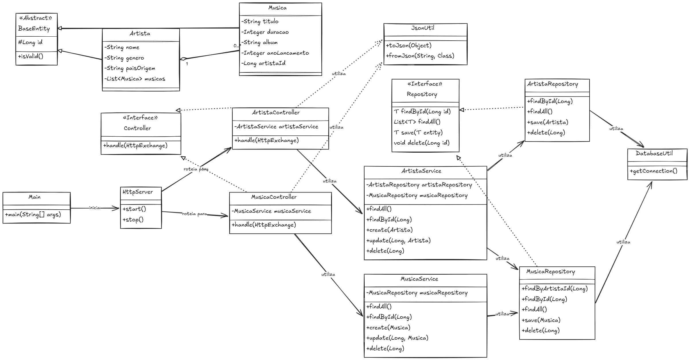

arquivo `README.md` atualizado: todas as letras maiúsculas convertidas para minúsculas e emojis removidos.

# sistema de gerenciamento musical

api rest para gerenciamento de artistas e músicas, java puro sem frameworks.

este projeto implementa uma api rest completa com:
- relacionamento 1:n: um artista pode ter várias músicas
- crud completo para ambas as entidades
- banco de dados h2 em memória
- conceitos de poo: abstração, encapsulamento, herança e polimorfismo
- arquitetura em camadas: model, repository, service, controller

### entidades

artista (1)
- id: long
- nome: string
- genero: string
- paisorigem: string
- musicas: list\<musica>

música (n)
- id: long
- titulo: string
- duracao: integer (em segundos)
- album: string
- anolancamento: integer
- artistaid: long (fk para artista)

## conceitos de poo implementados

### 1. abstração
- interface `repository<t>` define contrato genérico para repositórios
- interface `controller` define comportamento comum dos controllers
- classe abstrata `baseentity` como base para todas as entidades

### 2. encapsulamento
- atributos privados com getters/setters (lombok)
- lógica de negócio encapsulada nas classes service
- acesso ao banco encapsulado nos repositories

### 3. herança
- `artista` e `musica` estendem `baseentity`
- `artistarepository` e `musicarepository` implementam `repository<t>`
- `artistacontroller` e `musicacontroller` implementam `controller`

### 4. polimorfismo
- método `isvalid()` implementado de forma diferente em cada entidade
- método `handle()` implementado de forma específica em cada controller
- controllers tratados de forma polimórfica através da interface

## tecnologias utilizadas

- java 17
- maven para gerenciamento de dependências e build
- h2 database para banco de dados em memória
- gson, biblioteca do google para manipulação de json
- lombok para reduzir getter/setter/constructors
- httpserver para criar servidor web simples

